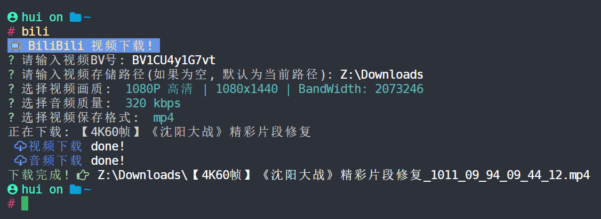

# <p align="center">Bili-Go🍻</p>

<h3 align="center">
<strong>一个 bilibili 视频下载器 📺( 命令行工具 )</strong>
<h4>

<div align="center"></div>

---

## 🟡 说明

<h3>不支持 多P,番剧,电视剧,电影 等视频的下载</h3>
<h3>视频与音频合并基于<a href="https://www.ffmpeg.org/download.html">FFmpeg</a>, 因此得先安装<a href="https://www.ffmpeg.org/download.html">FFmpeg</a></h3>
<br />

## 🟢 安装

<h3>下载 <a href="https://github.com/mouxiaohui/bili-go/releases">可执行文件</a> 并添加到环境变量</h3>

<br />

## 🔵 使用

```
NAME:
   bili-go - 命令行中下载 bilibili 视频

USAGE:
   bili-go [global options] command [command options] [arguments...]

VERSION:
   1.0

COMMANDS:
   help, h  Shows a list of commands or help for one command

GLOBAL OPTIONS:
   --bv value, -b value    视频的bv号
   --path value, -p value  视频存储位置(默认为当前路径)
   --help, -h              show help (default: false)
   --version, -v           print the version (default: false)
```
